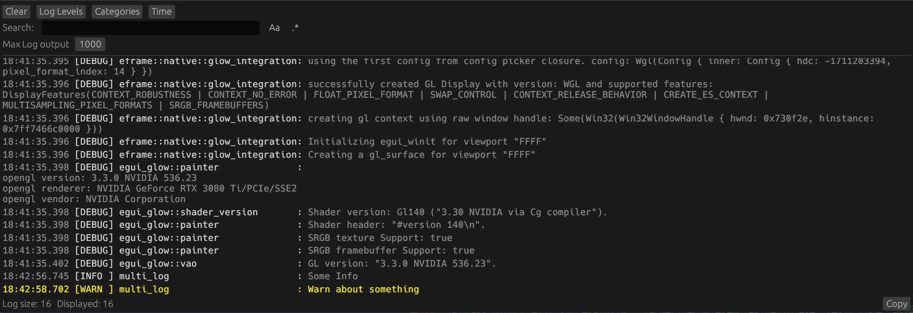

# egui_logger
This library implements [`log`](https://crates.io/crates/log) logging support into [`egui`](https://crates.io/crates/egui) applications.

## Demo


## Example

### initilazing:
```rust 
fn main() {
  // Should be called very early in the program.
  egui_logger::init().unwrap(); 
}
```

### inside your ui logic:

```rust 
Window::new("Log")::show(ctx, |ui| {
  // draws the logger ui.
  egui_logger::loger_ui(ui);
});
```

